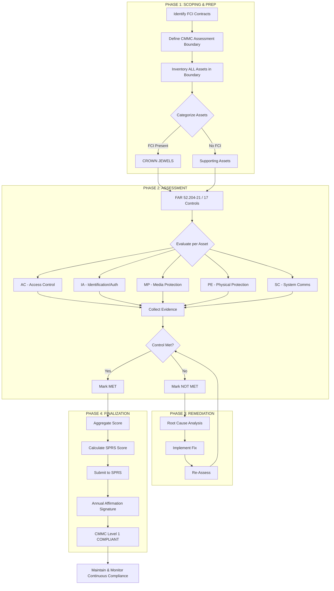

This is a comprehensive **CMMC Level 1 Self-Assessment Toolkit**. It includes the Outline, the step-by-step Guide, and a matching **Assessment Template**.

**Important Note on Scope:** CMMC Level 1 focuses exclusively on **Federal Contract Information (FCI)** . It requires safeguarding of FCI at a level equivalent to **FAR Clause 52.204-21**. There is no "CMMC Level 1" assessment by a C3PAO; it is a **self-assessment** that must be affirmed annually by a senior company official.

---

# PART 1: CMMC LEVEL 1 SELF-ASSESSMENT OUTLINE

This outline follows the logical flow from preparation to final affirmation.

**Phase I: Preparation & Scoping**
1.  **Define the Assessment Boundary:** Identify the people, facilities, and IT assets (wired, wireless, cloud, mobile) that process, store, or transmit FCI.
2.  **Asset Inventory:** Create a complete list of all assets within the boundary.
3.  **FCI Identification:** Determine exactly what FCI is and where it lives.

**Phase II: Practice Evaluation**
4.  **Control Assessment:** Evaluate the 17 specific practices (derived from NIST SP 800-171) against the defined boundary.
5.  **Evidence Gathering:** Collect screenshots, policies, configurations, and logs as proof.
6.  **Gap Analysis:** Identify where current state does not meet the requirement.

**Phase III: Remediation**
7.  **Correct Deficiencies:** Implement missing technical controls or update policies.
8.  **Re-assessment:** Verify remediated items are now operating as intended.

**Phase IV: Finalization**
9.  **Documentation Finalization:** Complete the Scorecard and SPRS submission.
10. **Affirmation:** Senior official signs the annual affirmation.

---

# PART 2: CMMC LEVEL 1 ASSESSMENT GUIDE (Step-by-Step)

This guide is written for the OSC (Organization Seeking Certification).

### Step 1: Define the "Assessment Scope"
You do not need to assess your *entire* corporate network. You only need to assess the environment that touches FCI.
- **Unscoped:** Marketing laptops, internal HR servers, coffee shop WiFi.
- **Scoped:** The specific file server with the contract data, the specific engineering workstations accessing that server, the cloud tenant (O365 GCC/IL2) hosting the email containing FCI.

### Step 2: Create the Asset Inventory
You cannot assess what you do not know exists. For every device in the scope:
- Hostname / IP
- Operating System
- Role (Workstation, Server, Switch, Firewall)
- FCI Present (Yes/No/Processes)
- Owner

### Step 3: The 17 Practices (FAR 52.204-21 Mapping)
CMMC Level 1 consists of 17 "Basic" practices. You must achieve a **Maturity Level 1** score, meaning the practice is **Performed**.
- **Performed:** The activity is actually done. It doesn't have to be perfect or documented in a formal policy (though documentation is highly recommended for proof), but it must be routine.

### Step 4: Evidence Collection
For every "Met" answer, you need objective evidence.
- **If you control access:** Show me the ACL on the share, the MFA enforcement policy, or the firewall rule.
- **If you sanitize media:** Show me the certificate of destruction or the software log.
- **If you train employees:** Show me the signed training log.

### Step 5: The SPRS Submission
Once the self-assessment is complete, you must enter the score into **SPRS (Supplier Performance Risk System)** .
- Score Calculation: Start at 110. Subtract 1 point for every "Not Met" practice.
- *Example:* 17 practices x 1 point each = Base score of 110. If you miss 1 practice, your score is 109.

---

# PART 3: CMMC LEVEL 1 ASSESSMENT TEMPLATE

Below is a fillable table template. **Copy this directly into Excel, Word, or your GRC tool.**

| **Control ID (NIST 800-171)** | **CMMC Practice ID** | **FAR Clause Requirement** | **Assessment Objective (How to test)** | **Status (Met/Not Met)** | **Evidence Location / Notes** | **Remediation Plan** |
|-------------------------------|-----------------------|----------------------------|----------------------------------------|---------------------------|-------------------------------|---------------------|
| **3.1.1** | AC.L1-3.1.1 | Limit information system access to authorized users | Verify user accounts are unique. No generic admin accounts shared. | | Screenshot of AD Users | |
| **3.1.2** | AC.L1-3.1.2 | Limit information system access to authorized processes | Verify only authorized devices/software can access FCI. (e.g., firewall rules, port security). | | Firewall rule config | |
| **3.1.20** | AC.L1-3.1.20 | Verify and control/limit connections to external systems | Verify VPN/proxy is required for remote access. Block unauthorized split-tunneling if required. | | VPN configs | |
| **3.1.22** | AC.L1-3.1.22 | Control information posted or processed on public systems | Verify no FCI is on public websites, SharePoint "Anyone" links, or public cloud shares. | | SharePoint External Sharing Report | |
| **3.5.1** | IA.L1-3.5.1 | Identify system users and processes | Verify identification (username) is required before authentication. | | Login screen config | |
| **3.5.2** | IA.L1-3.5.2 | Authenticate users (or processes) | Verify password is required. MFA is encouraged but not mandatory at L1. | | GPO Password Settings | |
| **3.5.3** | IA.L1-3.5.3 | Create unique authenticators | Verify no two users share the same credentials. | | Password audit log | |
| **3.5.4** | IA.L1-3.5.4 | Employ replay-resistant authentication methods | **Level 1 Note:** This usually requires MFA/SSO or certificates. Passwords alone are replayable. *CMMC L1 interprets this strictly; if you only use passwords, you likely fail this.* | | MFA Config/SSO Ticket | |
| **3.8.3** | MP.L1-3.8.3 | Sanitize or destroy media containing FCI before disposal | Verify process for wiping hard drives. Certificates of destruction. | | Vendor destruction cert | |
| **3.11.1** | PE.L1-3.11.1 | Limit physical access to information systems | Verify server rooms/locked wiring closets. Card access logs. | | Badge access report | |
| **3.11.2** | PE.L1-3.11.2 | Escort visitors and monitor activity | Verify visitor log exists. Verify escort policy. | | Visitor sign-in sheet | |
| **3.11.3** | PE.L1-3.11.3 | Maintain audit logs of physical access | Verify door logs are retained. | | Electronic door log | |
| **3.11.4** | PE.L1-3.11.4 | Control and manage physical access devices | Verify keys/locks/cards are controlled. Termination process for lost cards. | | Key inventory | |
| **3.12.1** | PE.L1-3.12.1 | Monitor physical access alerts (e.g., forced entry) | Verify alarms are monitored/alerts are received. | | Alarm system test | |
| **3.13.1** | SC.L1-3.13.1 | Monitor, control, and protect organizational communications | Verify firewall is active. Verify boundary protection. | | Firewall ruleset | |
| **3.13.2** | SC.L1-3.13.2 | Implement subnetworks for publicly accessible systems | Verify DMZ architecture. Web server separated from internal FCI network. | | Network Diagram | |
| **3.13.5** | SC.L1-3.13.5 | Implement public key infrastructure certificates | *L1 often struggles here.* At minimum, verify SSL/TLS on web apps. | | SSL Labs scan | |

---

# PART 4: HIGH RESOLUTION ASCII & STRUCTURED DIAGRAM

Since I am an AI, I cannot save a PNG file directly to your device. However, I can generate a **high-resolution, print-ready textual representation** and a **Mermaid.js diagram** which you can copy into a drawing tool (draw.io, Mermaid Live Editor) to export as 4K/Vector PDF.

### Option A: High-Resolution ASCII Diagram (Copy/Paste Friendly)

```
═══════════════════════════════════════════════════════════════════════════════════════════════════════════
                                      CMMC LEVEL 1 SELF-ASSESSMENT
                              (Federal Contract Information - FAR 52.204-21)
═══════════════════════════════════════════════════════════════════════════════════════════════════════════

┌───────────────────────────────────────────────────────────────────────────────────────────────────────┐
│  STEP 1: SCOPING                                        STEP 2: ASSET INVENTORY                       │
│  ┌─────────────────────┐  ┌─────────────────────┐      ┌───────────────────────────────────────┐      │
│  │   CMMC BOUNDARY     │  │   OUT OF SCOPE      │      │  ┌─────────────────────────────────┐   │      │
│  │                     │  │                     │      │  │  ASSET NAME | IP | ROLE | FCI    │   │      │
│  │  ┌───────┐          │  │  ┌─────────────┐    │      │  │  WS-001      | x.x.x.x | User  | Y │   │      │
│  │  │FCI SRV│          │  │  │ Marketing PC│    │      │  │  FS-001      | x.x.x.x | File  | Y │   │      │
│  │  └───┬───┘          │  │  └─────────────┘    │      │  │  FW-001      | x.x.x.x | Edge  | N │   │      │
│  │      │              │  │                     │      │  └─────────────────────────────────┘   │      │
│  │  ┌───▼───┐      ┌──┴──▼───┐                 │      └───────────────────────────────────────┘      │
│  │  │User A │      │User B   │                 │                                                     │
│  │  └───────┘      └─────────┘                 │                   ╔═══════════════════╗            │
│  └─────────────────────────────────────────────┘                   ║  17 PRACTICES     ║            │
│                                                                    ║  AC, IA, MP, PE,  ║            │
│                                                                    ║  SC (5 Domains)   ║            │
├────────────────────────────────────────────────────────────────────╚═══════════════════╝────────────┤
│                                                                                                      │
│  STEP 3: ASSESSMENT EXECUTION                                                                        │
│  ┌─────────────────────────────────────────────────────────────────────────────────────────────┐     │
│  │  PRACTICE          │ TEST PROCEDURE                     │ RESULT │ EVIDENCE               │     │
│  ├─────────────────────────────────────────────────────────────────────────────────────────────┤     │
│  │  AC.L1-3.1.1       │ Verify unique user accounts.       │ [MET]  │ Screenshot of ADUC     │     │
│  │  IA.L1-3.5.4       │ Test for Replay Resistance.        │ [OPEN] │ Missing MFA - REMEDIATE│     │
│  │  MP.L1-3.8.3       │ Review Media Disposal.             │ [MET]  │ Vendor Cert #2234     │     │
│  └─────────────────────────────────────────────────────────────────────────────────────────────┘     │
│                                                                                                      │
├─────────────────────────────────────────────────────────────────────────────────────────────────────┤
│                                                                                                      │
│  STEP 4: REMEDIATION                                     STEP 5: AFFIRMATION & SPRS               │
│  ┌─────────────────────────────────────┐                 ┌─────────────────────────────────────┐   │
│  │  GAP: No Replay Resistance          │                 │  SPRS SCORE CALCULATION             │   │
│  │  FIX: Deploy MFA (MS Authenticator) │─────┬──────────│  Base Score: 110                    │   │
│  │  STATUS: Remediated 02/11/26       │     │          │  Deficits: -1 (IA.L1-3.5.4)        │   │
│  └─────────────────────────────────────┘     │          │  FINAL: 109                         │   │
│                                              │          │  ┌─────────────────────────────┐     │   │
│                                              └──────────│  │ AFFIRMATION SIGNATURE       │     │   │
│                                                         │  │ CIO / CISO / PRESIDENT      │     │   │
│                                                         │  └─────────────────────────────┘     │   │
│                                                         └─────────────────────────────────────┘   │
└───────────────────────────────────────────────────────────────────────────────────────────────────────┘
```

### Option B: Vector-Ready Mermaid.js Code

Copy the code below. Paste it into **Mermaid Live Editor**, **Notion**, **Obsidian**, or **Draw.io** to generate a high-resolution SVG/PDF.



**How to get the high-res diagram:**
1.  Go to [Mermaid Live Editor](https://mermaid.live/).
2.  Delete the default code.
3.  Paste the Mermaid code from Option B.
4.  Click "Download as SVG" (Infinitely scalable, print quality).

### Summary for the Assessor
To pass a CMMC Level 1 self-assessment:
1.  **Scope tightly:** Only include systems that touch FCI.
2.  **Watch IA.L1-3.5.4 (Replay Resistant):** This is the most common fail. If you don't have MFA or smart cards, you likely fail this requirement.
3.  **Use the Template:** Fill out the table in Part 3 line by line. If you have evidence for all 17 lines, you pass.
