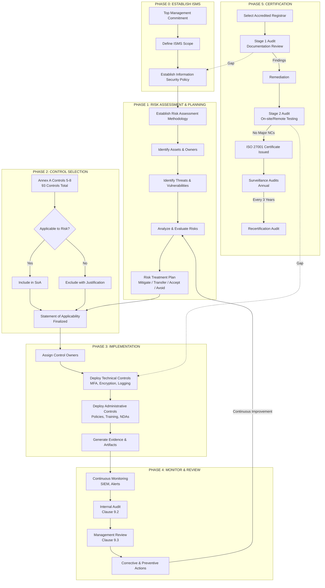

Here is the **ISO 27001:2022 Self-Assessment Toolkit**. Unlike CMMC (which is a narrow pass/fail on 17 specific items), ISO 27001 is a **management system standard**. It requires two distinct layers of assessment:
1.  **Clauses 4–10 (The ISMS itself):** Leadership, planning, support, operation, performance evaluation, improvement.
2.  **Annex A (The 93 Controls):** The specific security measures you choose to implement based on your risk assessment.

This guide provides the **Outline, Step-by-Step Guide, and Matching Template** covering both layers.

---

# PART 1: ISO 27001 SELF-ASSESSMENT OUTLINE

**Phase I: ISMS Foundation (Clauses 4–7)**
1.  **Context of the Organization:** Define internal/external issues, interested parties, and scope.
2.  **Leadership:** Confirm top management commitment and policy approval.
3.  **Risk Assessment:** Establish methodology; produce Risk Register.
4.  **Resources & Competence:** Assign roles and verify staff training.

**Phase II: Control Selection & Design (Annex A)**
5.  **Statement of Applicability (SoA):** Review the 93 controls; mark Applicable/Not Applicable with justification.
6.  **Control Design:** For applicable controls, ensure policies/procedures exist.

**Phase III: Operation & Evidence (Clause 8 & Annex A)**
7.  **Control Implementation:** Deploy technical and administrative controls.
8.  **Documentation:** Collect evidence (screenshots, logs, signed forms).

**Phase IV: Monitoring & Certification (Clauses 9–10)**
9.  **Internal Audit:** Perform formal audit of the ISMS.
10. **Management Review:** Top management reviews performance.
11. **Corrective Action:** Address nonconformities.
12. **Stage 1 & Stage 2 Audit Readiness.**

---

# PART 2: ISO 27001 ASSESSMENT GUIDE (Step-by-Step)

### Step 1: Understand the Two-Part Structure
You must pass **both** layers:
- **Layer 1 (System):** You must do risk assessments, internal audits, and management reviews. If you skip these, you fail regardless of how good your firewall is.
- **Layer 2 (Controls):** You do not need to implement all 93 controls. You only implement those identified as necessary by your risk assessment.

### Step 2: Scope Definition
Document **exactly** what is covered.
- *Example:* "The ISMS applies to the corporate headquarters in Chicago, the Azure EU-West tenant, and all full-time employees handling customer data."

### Step 3: The Risk Assessment (Mandatory)
You cannot be ISO 27001 certified without a documented risk assessment.
- **Methodology:** 5x5 matrix, OCTAVE, or NIST SP 800-30.
- **Output:** Risk Register with Asset ID, Threat, Vulnerability, Inherent Risk, Treatment (Mitigate/Transfer/Accept/Avoid), Residual Risk.

### Step 4: The Statement of Applicability (SoA) - *Critical*
This is the master checklist. You must review **all 93** Annex A controls (2022 revision).
- **Applicable:** Control is needed to treat a risk.
- **Not Applicable:** Control is not needed. You must write a **justification** (e.g., "No cloud services used; A.5.23 not applicable").
- **Implementation Status:** Implemented / Partially Implemented / Planned.

### Step 5: Evidence Collection
Auditors are "show me, don't tell me."
- **Policy exists?** Show the approved document with date/author.
- **Training occurred?** Show the sign-in sheet or LMS completion report.
- **Access revoked?** Show the termination checklist or HR ticket.

---

# PART 3: ISO 27001:2022 SELF-ASSESSMENT TEMPLATE

This template is structured to match the official ISO/IEC 27001:2022 structure. It is **Stage 1 Audit ready**.

### SECTION A: ISMS CLAUSES 4–10 (The "System" Audit)
*Assessment of the management system itself. Failure on any of these is a major nonconformity.*

| ISO Clause | Requirement | Assessment Question | Status (Y/N/Partial) | Evidence / Reference | Auditor Notes |
|------------|-------------|---------------------|------------------------|----------------------|---------------|
| **4** | **Context of Organization** | | | | |
| 4.1 | External/Internal Issues | Have you documented external (legal, political) and internal (culture, resources) issues relevant to the ISMS? | | Context Document v1.2 | |
| 4.3 | Scope of ISMS | Is the scope documented, including boundaries and exclusions? | | ISMS Scope Statement | |
| **5** | **Leadership** | | | | |
| 5.1 | Policy | Is the Information Security Policy approved by top management and communicated? | | Signed Policy, Intranet link | |
| 5.3 | Roles & Responsibilities | Are security roles (e.g., CISO, Risk Owner) defined? | | Org Chart, Job Descriptions | |
| **6** | **Planning** | | | | |
| 6.1.2 | Risk Assessment Process | Is there a documented risk assessment methodology? | | Risk Assessment Procedure | |
| 6.1.3 | Risk Treatment Plan | Does the plan assign owners and deadlines for each risk? | | Risk Treatment Plan | |
| **7** | **Support** | | | | |
| 7.2 | Competence | Is staff competency (training, skills) documented? | | Training Records | |
| 7.4 | Communication | Is there a process for internal/external communication of security issues? | | Comms Policy | |
| **8** | **Operation** | | | | |
| 8.1 | Operational Planning | Are risks assessed and treated before system changes? | | Change Management Tickets | |
| **9** | **Performance Evaluation** | | | | |
| 9.2 | Internal Audit | Has an internal audit been conducted in the last 12 months? | | Internal Audit Report | |
| 9.3 | Management Review | Is there a documented management review meeting? | | Minutes of Meeting | |
| **10** | **Improvement** | | | | |
| 10.1 | Nonconformity | Are corrective actions tracked to closure? | | CAPA Log | |

---

### SECTION B: ANNEX A CONTROLS (The "Technical & Administrative" Audit)
*This is the "Compliance Checklist" for the 93 controls. Due to space, this is a **condensed template structure**. For full assessment, replicate this row for all 93 controls.*

**Instructions:**
1.  Copy this table into Excel.
2.  List all 93 controls vertically.
3.  For each, mark **Applicable?** If Yes, assess **Status**.

| Annex A Ref (2022) | Control Name | Applicable? (Y/N) | Justification for Exclusion | Implementation Status (Implemented/Partial/Missing) | Evidence Collected | Gap / Remediation Plan |
|--------------------|--------------|-------------------|----------------------------|-----------------------------------------------------|--------------------|------------------------|
| **5. Organizational Controls** |
| 5.1 | Information Security Policies | Y | N/A - Core requirement | Implemented | Policy v4.0, Acknowledgment logs | None |
| 5.2 | Information Security Roles | Y | N/A | Implemented | RACI Matrix | None |
| 5.3 | Segregation of Duties | Y | N/A | Partial | Access rights conflict in Finance | Re-certify Q2 |
| 5.4 | Management Responsibilities | Y | N/A | Implemented | Performance reviews include security | None |
| 5.5 | Contact with Authorities | Y | N/A | Missing | No documented process | Create procedure by 30 Mar |
| 5.6 | Contact with Special Interest Groups | N | No membership in ISACCs/Forums | N/A | N/A | N/A |
| *... (Continue for 5.7 – 5.37)* |
| **6. People Controls** |
| 6.1 | Screening | Y | N/A | Implemented | Background check policy, HR receipts | None |
| 6.2 | Terms of Employment | Y | N/A | Implemented | Employment contracts | None |
| 6.3 | Awareness & Training | Y | N/A | Partial | Phishing training due for 40% of staff | Remediation in progress |
| *... (6.4 – 6.8)* |
| **7. Physical Controls** |
| 7.1 | Physical Security Perimeters | Y | N/A | Implemented | Badge access logs, CCTV | None |
| 7.2 | Physical Entry | Y | N/A | Implemented | Man trap functional | None |
| 7.3 | Securing Offices, Rooms, Facilities | Y | N/A | Implemented | Locked server racks | None |
| 7.4 | Physical Security Monitoring | Y | N/A | Partial | Alarms tested, no log review schedule | Create quarterly review |
| 7.5 | Protecting Against Threats | Y | N/A | Implemented | Fire suppression, UPS tested | None |
| *... (7.6 – 7.14)* |
| **8. Technological Controls** |
| 8.1 | User Endpoint Devices | Y | N/A | Implemented | Intune compliance policy | None |
| 8.2 | Privileged Access Rights | Y | N/A | Partial | No quarterly review of admin accounts | Schedule review |
| 8.5 | Secure Authentication | Y | N/A | Partial | MFA enabled on VPN, not on OWA | Rollout MFA by EOM |
| 8.11 | Data Masking | N | No production data used in test environments | Justified | N/A | N/A |
| 8.16 | Monitoring Activities | Y | N/A | Implemented | SIEM logs ingested | None |
| 8.24 | Use of Cryptography | Y | N/A | Implemented | BitLocker, TLS 1.2+ | None |
| *... (8.33, 8.34, etc.)* |

---

# PART 4: HIGH RESOLUTION ISO 27001 PROCESS DIAGRAM

Since I cannot save a PNG directly to your device, I have generated two formats below.

### Option A: High-Resolution ASCII Diagram (Print Ready)

```
═══════════════════════════════════════════════════════════════════════════════════════════════════════════════════
                                    ISO/IEC 27001:2022 - CERTIFICATION JOURNEY
                              (Information Security Management System - PDCA Model)
═══════════════════════════════════════════════════════════════════════════════════════════════════════════════════

┌─────────────────────────────────────────────────────────────────────────────────────────────────────────────────┐
│  PHASE 0: COMMITMENT & SCOPE                                                                                    │
│  ┌─────────────────────────────────────────────────────────────────────────────────────────────────────────┐   │
│  │  [TOP MANAGEMENT]                             [SCOPE DEFINITION]                                       │   │
│  │  • Appoint ISMS Representative          ──►  • Organizational Units                                  │   │
│  │  • Approve Budget                            • Physical Locations                                     │   │
│  │  • Define Security Policy                    • Assets / Applications                                   │   │
│  └─────────────────────────────────────────────────────────────────────────────────────────────────────────┘   │
│                                                                                                                 │
├─────────────────────────────────────────────────────────────────────────────────────────────────────────────────┤
│                                                                                                                 │
│  PHASE 1: RISK ASSESSMENT (Clause 6.1.2)                       PHASE 2: STATEMENT OF APPLICABILITY (Clause 6.1.3 d) │
│  ┌─────────────────────────────────────────────┐               ┌─────────────────────────────────────────────┐   │
│  │  ASSET ID ──► THREAT ──► VULN ──► RISK      │               │  Annex A (93 Controls)                     │   │
│  │  ┌─────────────────────────────────────┐    │               │  ┌─────────────────────────────────────┐    │   │
│  │  │ Risk ID: R-001                      │    │               │  │ Control 5.x: Org Controls     [YES]  │    │   │
│  │  │ Asset: Customer DB (SQL Server)     │    │   SELECT      │  │ Control 6.x: People Controls   [YES]  │───► SOA │
│  │  │ Threat: Unauthorized Access         │    │   ─────►      │  │ Control 7.x: Physical Controls [NO]   │    │   │
│  │  │ Likelihood: 3, Impact: 4 = 12 (High)│    │               │  │ Justification: No local office │    │   │
│  │  └─────────────────────────────────────┘    │               │  └─────────────────────────────────────┘    │   │
│  └─────────────────────────────────────────────┘               └─────────────────────────────────────────────┘   │
│                                                                                                                 │
├─────────────────────────────────────────────────────────────────────────────────────────────────────────────────┤
│                                                                                                                 │
│  PHASE 3: IMPLEMENTATION                                   PHASE 4: MONITORING & REVIEW                       │
│  ┌───────────────────────────────────────────┐             ┌───────────────────────────────────────────────┐   │
│  │  CONTROL DEPLOYMENT                       │             │  INTERNAL AUDIT (Clause 9.2)                 │   │
│  │  • MFA Implementation (8.5)              │             │  ┌───────────────────────────────────────┐   │   │
│  │  • IDS/IPS Configuration (8.16)          │             │  │  Nonconformity Report: NCR-001        │   │   │
│  │  • Vendor NDA Execution (5.19)           │             │  │  Root Cause: Missing review schedule  │   │   │
│  │  • Training Completion (6.3)             │             │  │  CAPA: Implemented Q2                 │   │   │
│  └───────────────────────────────────────────┘             │  └───────────────────────────────────────┘   │   │
│                                                            │                                               │   │
│                                                            │  MANAGEMENT REVIEW (Clause 9.3)             │   │
│                                                            │  ┌───────────────────────────────────────┐   │   │
│                                                            │  │  Input: Audit results, Incidents      │   │   │
│                                                            │  │  Output: Resource allocation, Policy  │   │   │
│                                                            │  │          updates                     │   │   │
│                                                            │  └───────────────────────────────────────┘   │   │
│                                                            └───────────────────────────────────────────────┘   │
│                                                                                                                 │
├─────────────────────────────────────────────────────────────────────────────────────────────────────────────────┤
│                                                                                                                 │
│  PHASE 5: CERTIFICATION AUDIT                                                                                  │
│  ┌─────────────────────────────────────────────────────────────────────────────────────────────────────────┐   │
│  │                                                                                                         │   │
│  │     STAGE 1 AUDIT                                STAGE 2 AUDIT                                        │   │
│  │  ┌───────────────────────┐                    ┌─────────────────────────────────────┐                │   │
│  │  │  Documentation Review │                    │  Operational Effectiveness Testing  │                │   │
│  │  │  • Scope correct?     │                    │  • "Show me" evidence              │   ISO 27001    │   │
│  │  │  • SoA complete?      │────── READY ──────►  • Sample testing of controls       │   CERTIFICATE  │   │
│  │  │  • Risk Method valid? │                    │  • Staff interviews                │     AWARDED    │   │
│  │  └───────────────────────┘                    └─────────────────────────────────────┘                │   │
│  │                                                                                                         │   │
│  └─────────────────────────────────────────────────────────────────────────────────────────────────────────┘   │
└─────────────────────────────────────────────────────────────────────────────────────────────────────────────────┘
```

### Option B: Vector-Ready Mermaid.js Code (SVG/PDF Exportable)

Copy the code below. Paste it into **Mermaid Live Editor**, **Notion**, or **Draw.io** to generate an infinitely scalable high-resolution diagram.



---

# Summary: How to Use This Kit for Certification

1.  **Start with the ISMS Clauses (Section A):** If you haven't done a Management Review or Internal Audit, you are not ready for certification. Fix these first.
2.  **Build your SoA (Section B):** Review all 93 controls. Do not simply mark everything "Applicable." Auditors will challenge exclusions, but it is better to justify an exclusion than to claim a control is implemented when it is not.
3.  **Evidence Rules Everything:** An ISO auditor will rarely take your word for it. If the template says "Evidence Location," populate it with a real file path (e.g., `SharePoint\ISMS\Audit\2026_Internal_Audit_Report.pdf`).
4.  **Diagram:** Use the Mermaid code to print a large poster for your "War Room" to track progress.
