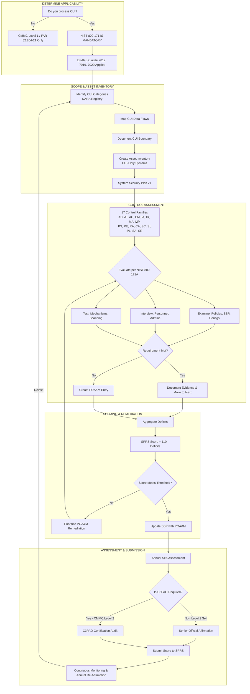

Here is the **NIST SP 800-171 Self-Assessment Toolkit** (Rev. 3 Ready). Unlike CMMC Level 1 (17 controls for FCI) and ISO 27001 (93 controls with full discretion), **NIST 800-171 is mandatory, non-negotiable, and specific**. If you handle Controlled Unclassified Information (CUI) on a federal contract, you must implement **ALL 110 requirements** (Rev. 2) or **ALL 101+ requirements** (Rev. 3) unless explicitly waived.

This guide is structured for **DoD Contractors, University Research Centers, and Federal Subcontractors** required to submit a Score to SPRS or pass a C3PAO assessment.

---

# PART 1: NIST SP 800-171 SELF-ASSESSMENT OUTLINE

**Phase I: Scoping & CUI Identification**
1.  **CUI Registry Review:** Identify exactly which CUI categories (Critical Infrastructure, Defense, Export Control, etc.) you process .
2.  **CUI Data Flow Mapping:** Trace where CUI enters, resides, transmits, and exits .
3.  **Asset Inventory (CUI-Only):** Isolate all assets that process, store, or transmit CUI. **Non-CUI assets are out of scope.**

**Phase II: Gap Assessment (The 14/17 Families)**
4.  **Control Baseline:** Evaluate your posture against **ALL** security requirements (Rev. 2 = 110; Rev. 3 = 101 + new enhancements).
5.  **Scoring:** Calculate your **DoD Assessment Methodology Score (SPRS Score)** .
    - *Formula:* Start at 110. Subtract 1 point for each "Not Met" requirement.
6.  **POA&M Generation:** For every "Not Met" control, create a **Plan of Action and Milestones** with a dated remediation plan .

**Phase III: Documentation**
7.  **System Security Plan (SSP):** Describe your environment and how you meet each requirement.
8.  **Evidence Repository:** Screenshots, policies, logs, and configuration files mapped to specific controls.

**Phase IV: Formal Assessment & Affirmation**
9.  **Self-Assessment vs. Certification:**
    - *Level 1 Self:* Senior official affirms; no C3PAO required.
    - *Level 2 (CMMC):* C3PAO Certification Audit required.
10. **SPRS Submission:** Final score posted to Supplier Performance Risk System.

---

# PART 2: NIST 800-171 ASSESSMENT GUIDE (Critical Context)

## 2.1 Revision 3 is Here
Search results confirm **NIST SP 800-171 Revision 3** introduces significant changes :
- **Alignment with NIST 800-53 Rev. 5:** Controls now map cleanly to federal enterprise standards.
- **New Control Enhancements:** Secure software development, advanced data protection, supply chain risk management (SCRM).
- **Cyber Resilience:** Focus on recovery from sophisticated attacks (APTs, ransomware).
- **Continuous Monitoring:** Expanded expectations for ongoing assessment.
- **Clarity & Flexibility:** Language adjusted for implementation tailoring.

**⚠️ Critical:** Many templates online are still Rev. 2. The templates below are **Rev. 3 ready** but maintain backward compatibility.

## 2.2 The 14 (Now 17?) Control Families
NIST 800-171 is organized by families. **Revision 3** adds 3 new families, expanding structure :

| Rev. 2 Families (14) | Rev. 3 Families (17) | Focus Area |
|----------------------|----------------------|------------|
| AC                   | AC                   | Access Control |
| AT                   | AT                   | Awareness & Training |
| AU                   | AU                   | Audit & Accountability |
| CM                   | CM                   | Configuration Management |
| IA                   | IA                   | Identification & Authentication |
| IR                   | IR                   | Incident Response |
| MA                   | MA                   | Maintenance |
| MP                   | MP                   | Media Protection |
| PS                   | PS                   | Personnel Security |
| PE                   | PE                   | Physical Protection |
| RA                   | RA                   | Risk Assessment |
| CA                   | CA                   | Security Assessment & Monitoring |
| SC                   | SC                   | System & Communications Protection |
| SI                   | SI                   | System & Information Integrity |
| **--**               | **PL**               | **Planning (NEW)** |
| **--**               | **SA**               | **System & Services Acquisition (NEW)** |
| **--**               | **SR**               | **Supply Chain Risk Management (NEW)** |

## 2.3 Assessment Methodology (NIST SP 800-171A)
You do not guess. You prove it using three methods :
1.  **Examine:** Review policy documents, SSPs, configuration files.
2.  **Interview:** Talk to system administrators, security officers, users.
3.  **Test:** Execute actions. Attempt to bypass MFA. Scan for vulnerabilities. Verify logs generate.

---

# PART 3: NIST SP 800-171 SELF-ASSESSMENT TEMPLATE (Rev. 3 Structure)

This template is designed for **SPRS scoring, POA&M tracking, and Audit readiness**. It consolidates the 17 control families across 3 master worksheets.

### WORKSHEET A: Executive Summary & Scoring Calculator
*Auto-calculates DoD Score (110 - Deficits)*

| Metric | Value |
|--------|-------|
| Total Security Requirements (Rev. 3) | 101+ (exact count depends on enhancements selected) |
| Requirements Met | 89 |
| Requirements Not Met (Deficits) | 12 |
| **SPRS SCORE** | **110 - 12 = 98** |
| POA&M Items Open | 12 |
| Estimated Remediation Date | 31-DEC-2026 |

---

### WORKSHEET B: Detailed Control Assessment (By Family)

**Instructions:**
1. List each requirement.
2. Status: `Met` / `Not Met` / `Not Applicable` (N/A is rare; must justify).
3. Evidence: Provide direct link or file path.
4. POA&M: If Not Met, provide Plan.

---

#### FAMILY 1: ACCESS CONTROL (AC)

| Req ID | Requirement Summary | Assessment Status | Evidence Location | POA&M / Remediation Plan |
|--------|---------------------|-------------------|-------------------|--------------------------|
| **3.1.1** | Limit system access to authorized users | Met | AD User list, MFA enforcement policy | N/A |
| **3.1.2** | Limit system access to authorized processes | Met | Firewall rules, AppLocker policy | N/A |
| **3.1.3** | Control remote access systems | Partial | VPN configured; no MFA on VPN | Deploy MFA to VPN by 30MAR |
| **3.1.4** | Wireless access restrictions | Not Met | No policy for CUI on Wi-Fi | Create wireless security policy; isolate CUI VLAN |
| **3.1.5** | Access control for mobile devices | Met | Intune compliance policy | N/A |
| **3.1.6** | Limit use of portable storage | Partial | USB blocked on CUI workstations; no logging | Enable USB audit logging |
| **3.1.7** | Separate public-facing systems from internal | Met | DMZ architecture documented | N/A |
| **3.1.8** | Unsuccessful login attempts | Not Met | No account lockout policy configured | Configure GPO: 5 attempts, 15 min lockout |
| **3.1.9** | Privacy and security notices | Met | Banner displayed at login | N/A |
| **3.1.10** | Session lock | Met | Screen saver timeout 15 min | N/A |
| **3.1.11** | Terminate sessions after inactivity | Partial | Session timeout set; no network-level termination | Implement idle session termination on firewall |
| **3.1.12** | Monitor and control remote access sessions | Met | SIEM ingests VPN logs | N/A |
| **... (Continue all AC requirements)** | | | | |

---

#### FAMILY 2: AWARENESS & TRAINING (AT)

| Req ID | Requirement Summary | Assessment Status | Evidence Location | POA&M |
|--------|---------------------|-------------------|-------------------|-------|
| **3.2.1** | Basic security awareness training | Met | Annual training completion logs | N/A |
| **3.2.2** | Role-based training for privileged users | Not Met | No specific admin training documented | Develop role-based training module; deliver Q3 |
| **3.2.3** | Training records retention | Met | LMS records retained 3 years | N/A |

---

#### FAMILY 3: AUDIT & ACCOUNTABILITY (AU)

| Req ID | Requirement Summary | Assessment Status | Evidence Location | POA&M |
|--------|---------------------|-------------------|-------------------|-------|
| **3.3.1** | Create audit logs | Met | Windows Event Logs enabled | N/A |
| **3.3.2** | Audit log content | Partial | Logs missing CUI access events | Reconfigure audit policy for File System access |
| **3.3.3** | Audit log storage & protection | Met | Logs sent to SIEM, access restricted | N/A |
| **3.3.4** | Audit log review, analysis, reporting | Not Met | No regular log review schedule | Implement weekly log review by SOC |
| **3.3.5** | Audit log retention | Met | 1 year online, 3 years archive | N/A |
| **3.3.6** | Audit reduction and report generation | Not Met | No automated correlation tools | Deploy SIEM reporting module |
| **3.3.7** | Time stamps | Met | NTP configured to authoritative source | N/A |
| **3.3.8** | Protection of audit information | Met | Logs encrypted at rest | N/A |
| **3.3.9** | Audit record management | Partial | No formal disposition process | Define audit log retention/deletion policy |

---

#### FAMILY 4: CONFIGURATION MANAGEMENT (CM)

| Req ID | Requirement Summary | Assessment Status | Evidence Location | POA&M |
|--------|---------------------|-------------------|-------------------|-------|
| **3.4.1** | Baseline configurations | Met | Gold image documented | N/A |
| **3.4.2** | Configuration change control | Partial | Change tickets exist; no approval workflow | Implement formal CAB process |
| **3.4.3** | Least functionality | Met | Unnecessary services disabled | N/A |
| **3.4.4** | Unnecessary programs/services | Met | Application whitelisting enforced | N/A |
| **3.4.5** | Authorized software list | Not Met | No formal approved software catalog | Create approved software list; review quarterly |
| **3.4.6** | Configuration settings | Met | CIS Benchmarks applied | N/A |
| **3.4.7** | Least functionality for components | Not Assessed | Network devices not reviewed | Schedule network device configuration audit |
| **3.4.8** | Information system component inventory | Partial | Inventory incomplete (missing cloud assets) | Complete CMDB sync with Azure |

---

#### FAMILY 5: IDENTIFICATION & AUTHENTICATION (IA)

| Req ID | Requirement Summary | Assessment Status | Evidence Location | POA&M |
|--------|---------------------|-------------------|-------------------|-------|
| **3.5.1** | Identify users and devices | Met | Unique usernames; device certs | N/A |
| **3.5.2** | Authenticate users and devices | Met | Passphrase + MFA for email | N/A |
| **3.5.3** | Multifactor authentication | **Not Met** | MFA not enforced for VPN or OWA | **CRITICAL GAP** - Deploy MFA by 30APR |
| **3.5.4** | Replay-resistant authentication | **Not Met** | Password only; no certificates | Implement MFA (satisfies replay resistant) |
| **3.5.5** | Identifier reuse | Met | AD policy prevents reuse for 1 year | N/A |
| **3.5.6** | Identifier obfuscation | Met | No employee IDs used as usernames | N/A |
| **3.5.7** | Password complexity | Met | 12 char, 3 of 4 character types | N/A |
| **3.5.8** | Password age | Partial | Max age 90 days; no minimum age | Set minimum password age 1 day |
| **3.5.9** | Password reuse | Met | 24 passwords remembered | N/A |
| **3.5.10** | Password storage | Met | Hashed with salt | N/A |
| **3.5.11** | Password feedback | Met | Characters masked | N/A |
| **3.5.12** | Authenticator management | Partial | No defined process for hardware tokens | Define token issuance/revocation procedure |

---

#### FAMILY 6: INCIDENT RESPONSE (IR)

| Req ID | Requirement Summary | Assessment Status | Evidence Location | POA&M |
|--------|---------------------|-------------------|-------------------|-------|
| **3.6.1** | Incident response plan | Met | IR Plan v2.3 approved | N/A |
| **3.6.2** | IR training | Not Met | No tabletop exercises conducted | Schedule Q2 tabletop exercise |
| **3.6.3** | IR testing | Not Met | Plan never tested | Conduct drill; document after-action |
| **3.6.4** | Incident monitoring & reporting | Partial | No formal CUI breach reporting process | Establish CUI incident notification procedure |
| **3.6.5** | Incident response assistance | Met | Retained IR retainer with CrowdStrike | N/A |

---

#### FAMILY 7: MAINTENANCE (MA)

| Req ID | Requirement Summary | Assessment Status | Evidence Location | POA&M |
|--------|---------------------|-------------------|-------------------|-------|
| **3.7.1** | Maintenance tools & personnel | Met | Vendor background checks completed | N/A |
| **3.7.2** | Remote maintenance | Met | Encrypted remote sessions; disabled when not in use | N/A |
| **3.7.3** | Maintenance personnel | Met | Escort policy for non-employees | N/A |
| **3.7.4** | Maintenance documentation | Partial | No centralized log of maintenance activity | Implement maintenance log form |
| **3.7.5** | Prevent unauthorized removal | Met | Equipment pass policy enforced | N/A |

---

#### FAMILY 8: MEDIA PROTECTION (MP)

| Req ID | Requirement Summary | Assessment Status | Evidence Location | POA&M |
|--------|---------------------|-------------------|-------------------|-------|
| **3.8.1** | Media disposal | Met | Certificates of destruction on file | N/A |
| **3.8.2** | Media reuse | Met | NIST 800-88 purge performed | N/A |
| **3.8.3** | Media marking | Not Met | No labeling standard for removable media | Implement CUI marking procedure |
| **3.8.4** | Media transport | Met | Encrypted laptops only; courier service | N/A |
| **3.8.5** | Portable storage | Partial | USB blocked; no accountability for authorized devices | Implement device authorization tracking |

---

#### FAMILY 9: PERSONNEL SECURITY (PS)

| Req ID | Requirement Summary | Assessment Status | Evidence Location | POA&M |
|--------|---------------------|-------------------|-------------------|-------|
| **3.9.1** | Personnel screening | Met | Background checks per CFR | N/A |
| **3.9.2** | Personnel termination | Met | Exit checklist; access revoked within 24h | N/A |
| **3.9.3** | Personnel transfer | Not Met | No formal transfer access review | Implement transfer access recertification |

---

#### FAMILY 10: PHYSICAL PROTECTION (PE)

| Req ID | Requirement Summary | Assessment Status | Evidence Location | POA&M |
|--------|---------------------|-------------------|-------------------|-------|
| **3.10.1** | Physical access authorizations | Met | Badge access lists | N/A |
| **3.10.2** | Physical access monitoring | Partial | CCTV installed; no retention policy | Define retention; post signage |
| **3.10.3** | Visitor control | Met | Visitor log; escorts enforced | N/A |
| **3.10.4** | Physical access logs | Partial | Electronic logs not reviewed | Implement monthly access log audit |
| **3.10.5** | Manage physical access devices | Met | Key/card issuance procedure | N/A |
| **3.10.6** | Physical access alerts | Not Met | No door forced-entry alarm monitoring | Install monitored alarms; test quarterly |

---

#### FAMILY 11: RISK ASSESSMENT (RA)

| Req ID | Requirement Summary | Assessment Status | Evidence Location | POA&M |
|--------|---------------------|-------------------|-------------------|-------|
| **3.11.1** | Risk assessments | Met | Annual risk assessment complete | N/A |
| **3.11.2** | Vulnerability scanning | Partial | Quarterly scans; no authenticated scanning | Implement credentialed scanning |
| **3.11.3** | Remediation prioritization | Met | Remediation SLA based on CVSS | N/A |

---

#### FAMILY 12: SECURITY ASSESSMENT & MONITORING (CA)

| Req ID | Requirement Summary | Assessment Status | Evidence Location | POA&M |
|--------|---------------------|-------------------|-------------------|-------|
| **3.12.1** | Security control assessment | Met | Self-assessment performed annually | N/A |
| **3.12.2** | Continuous monitoring | Not Met | No formal ISCM strategy | Develop ISCM plan; implement monthly reporting |
| **3.12.3** | Plan of Action & Milestones | Partial | POA&M exists; not updated quarterly | Assign owners; enforce quarterly updates |
| **3.12.4** | Security assessment reports | Met | SAR on file | N/A |

---

#### FAMILY 13: SYSTEM & COMMUNICATIONS PROTECTION (SC)

| Req ID | Requirement Summary | Assessment Status | Evidence Location | POA&M |
|--------|---------------------|-------------------|-------------------|-------|
| **3.13.1** | Boundary protection | Met | Firewalls, IDS deployed | N/A |
| **3.13.2** | Public access separation | Met | DMZ architecture | N/A |
| **3.13.3** | Collaborative computing | Met | Disable microphones/cameras in conference rooms | N/A |
| **3.13.4** | Denial of service protection | Partial | No DoD-specific DoS mitigation | Implement rate limiting; DDoS service |
| **3.13.5** | Network infrastructure documentation | Not Met | No current network diagram | Create Visio diagram with CUI boundary |
| **3.13.6** | Network segregation | Met | CUI VLAN isolated | N/A |
| **3.13.7** | Cryptographic key management | Partial | Keys stored; no formal rotation schedule | Define key rotation policy |
| **3.13.8** | Transmission confidentiality | Met | TLS 1.2+ for all external comms | N/A |
| **3.13.9** | Transmission integrity | Met | TLS provides integrity | N/A |
| **3.13.10** | Network disconnect | Met | Automatic timeout for VPN | N/A |
| **3.13.11** | Cryptographic module authentication | Not Met | FIPS 140-2 not validated on all devices | Replace non-FIPS modules; upgrade firmware |
| **3.13.12** | Mobile code | Not Met | No restrictions on mobile code (JavaScript, etc.) | Implement web content filtering policy |
| **3.13.13** | Voice over IP | N/A | No VoIP in CUI environment | Justified |
| **3.13.14** | Real-time communications | N/A | No CUI over chat/video | Justified |
| **3.13.15** | Communications security controls | Partial | No encryption policy for all network traffic | Publish encryption standard |

---

#### FAMILY 14: SYSTEM & INFORMATION INTEGRITY (SI)

| Req ID | Requirement Summary | Assessment Status | Evidence Location | POA&M |
|--------|---------------------|-------------------|-------------------|-------|
| **3.14.1** | Flaw remediation | Met | Patch management policy; monthly patching | N/A |
| **3.14.2** | Malicious code protection | Met | EDR deployed | N/A |
| **3.14.3** | Malicious code signature updates | Met | Automatic updates | N/A |
| **3.14.4** | Malicious code protection updates | Met | Daily signature updates | N/A |
| **3.14.5** | System & file scanning | Met | Weekly scans; real-time protection | N/A |
| **3.14.6** | Monitoring physical & logical attacks | Not Met | No specific threat monitoring | Deploy threat intel feed; tune SIEM rules |
| **3.14.7** | Security alerts & advisories | Partial | No formal CISA/IC3 monitoring process | Subscribe to US-CERT; assign review responsibility |

---

#### FAMILY 15: PLANNING (PL) - NEW in Rev. 3

| Req ID | Requirement Summary | Assessment Status | Evidence Location | POA&M |
|--------|---------------------|-------------------|-------------------|-------|
| **3.15.1** | System Security Plan (SSP) | Met | SSP v3.2 approved | N/A |
| **3.15.2** | SSP coordination | Met | Signed by CISO and CIO | N/A |
| **3.15.3** | Rules of behavior | Met | Acceptable use policy signed | N/A |
| **3.15.4** | Information security architecture | Not Met | No enterprise security architecture document | Develop security architecture diagram/description |

---

#### FAMILY 16: SYSTEM & SERVICES ACQUISITION (SA) - NEW in Rev. 3

| Req ID | Requirement Summary | Assessment Status | Evidence Location | POA&M |
|--------|---------------------|-------------------|-------------------|-------|
| **3.16.1** | System development lifecycle | Not Met | No formal secure SDLC | Implement DevSecOps gates; training |
| **3.16.2** | Security requirements for acquisitions | Partial | Contracts include DFARS clause; no flowdown verification | Implement vendor compliance verification |
| **3.16.3** | Developer security testing | N/A | No custom development | Justified |
| **3.16.4** | Supply chain risk management | Not Met | No vendor risk assessment process | **NEW GAP** - Create SCRM policy by Q4 |

---

#### FAMILY 17: SUPPLY CHAIN RISK MANAGEMENT (SR) - NEW in Rev. 3

| Req ID | Requirement Summary | Assessment Status | Evidence Location | POA&M |
|--------|---------------------|-------------------|-------------------|-------|
| **3.17.1** | Supply chain risk management plan | Not Met | No SCRM plan | Draft SCRM plan; assign SR lead |
| **3.17.2** | Vendor screening | Not Met | No cyber risk questionnaire for vendors | Deploy vendor risk assessments (UpGuard template)  |
| **3.17.3** | Supply chain incident reporting | Not Met | No vendor incident notification requirement | Update procurement Ts&Cs |

---

# PART 4: HIGH RESOLUTION NIST 800-171 PROCESS DIAGRAM

### Option A: High-Resolution ASCII Diagram (Print Ready)

```
═══════════════════════════════════════════════════════════════════════════════════════════════════════════════════
                    NIST SP 800-171 (Rev. 3) - CUI COMPLIANCE JOURNEY & SELF-ASSESSMENT WORKFLOW
            (Mandatory for DoD Contractors, Federal Subcontractors, and Research Institutions Handling CUI)
═══════════════════════════════════════════════════════════════════════════════════════════════════════════════════

┌─────────────────────────────────────────────────────────────────────────────────────────────────────────────────┐
│  STEP 1: DETERMINE APPLICABILITY                                                                                │
│  ┌─────────────────────────────────────────────────────────────────────────────────────────────────────────┐   │
│  │  Do you process, store, or transmit CUI?                                                                 │   │
│  │  (See NARA CUI Registry: 18 Categories - Defense, Export Control, Nuclear, Procurement, etc.) [5]       │   │
│  │                                                                                                           │   │
│  │  ┌─► YES: NIST 800-171 IS MANDATORY. Compliance required per DFARS 7012/7019/7020.                      │   │
│  │  └─► NO: CMMC Level 1 (FCI only) may apply. STOP.                                                       │   │
│  └─────────────────────────────────────────────────────────────────────────────────────────────────────────┘   │
│                                                                                                                 │
├─────────────────────────────────────────────────────────────────────────────────────────────────────────────────┤
│                                                                                                                 │
│  STEP 2: SCOPING & BOUNDARY DEFINITION                                STEP 3: BASELINE ASSESSMENT            │
│  ┌─────────────────────────────────────────────────────────┐         ┌──────────────────────────────────────┐   │
│  │  1. Identify ALL CUI locations                         │         │  1. Evaluate 14 (now 17) Families   │   │
│  │     - File Servers / SharePoint / Teams               │         │     AC, AT, AU, CM, IA, IR, MA,    │   │
│  │     - Engineering Workstations                         │         │     MP, PS, PE, RA, CA, SC, SI     │   │
│  │     - Cloud Tenants (O365 GCC, AWS, Azure)             │         │     **PL, SA, SR (NEW)**           │   │
│  │     - Backup Tapes / Cold Storage                      │         │                                     │   │
│  │  2. Document in SSP                                    │         │  2. Use NIST SP 800-171A Methods   │   │
│  │     - Network Diagram with CUI Boundary                │         │     ├─ Examine (Docs)              │   │
│  │     - Data Flow Diagram                                │         │     ├─ Interview (People)          │   │
│  │  3. Asset Inventory (CUI-Only)                         │         │     └─ Test (Configs) [7][9]      │   │
│  └─────────────────────────────────────────────────────────┘         └──────────────────────────────────────┘   │
│                                                                                    │                           │
│                                          ┌────────────────────────────────────────┴─────────────────────┐     │
│                                          ▼                                                              ▼     │
│                            ┌─────────────────────────┐                              ┌─────────────────────────┐ │
│                            │   CONTROL = MET         │                              │   CONTROL = NOT MET      │ │
│                            │   • Evidence Collected  │                              │   • Record Deficit       │ │
│                            │   • Document in SSP     │                              │   • Create POA&M [1][4]  │ │
│                            └─────────────────────────┘                              └─────────────────────────┘ │
│                                          │                                                      │               │
│                                          └─────────────┬────────────────────────────────────────┘               │
│                                                        ▼                                                        │
│                                         ┌────────────────────────────────────┐                                 │
│                                         │   STEP 4: SCORING (DoD Method)     │                                 │
│                                         │   Base Score: 110                 │                                 │
│                                         │   Less: # Deficits = -12          │                                 │
│                                         │   ─────────────────────────────   │                                 │
│                                         │   **SPRS SCORE: 98**             │                                 │
│                                         │   (Must be > 70 for contract award)│                                 │
│                                         └────────────────────────────────────┘                                 │
│                                                        │                                                      │
│                                                        ▼                                                      │
│                                         ┌────────────────────────────────────┐                                 │
│                                         │   STEP 5: DOCUMENTATION & SSP      │                                 │
│                                         │   • System Security Plan (NIST    │                                 │
│                                         │     format) [4]                   │                                 │
│                                         │   • POA&M Log (Living Document)    │                                 │
│                                         │   • Evidence Repository           │                                 │
│                                         └────────────────────────────────────┘                                 │
│                                                        │                                                      │
│                                                        ▼                                                      │
│                                         ┌────────────────────────────────────┐                                 │
│                                         │   STEP 6: AFFIRMATION             │                                 │
│                                         │   ┌─────────────────────────────┐  │                                 │
│                                         │   │  SELF: Senior Official     │  │  (No C3PAO)                  │
│                                         │   │  Signature (Level 1)       │  │                              │
│                                         │   ├─────────────────────────────┤  │                              │
│                                         │   │  CERT: C3PAO Audit         │  │  (CMMC Level 2/3)           │
│                                         │   │  (Level 2/3)               │  │                              │
│                                         │   └─────────────────────────────┘  │                                 │
│                                         └────────────────────────────────────┘                                 │
│                                                        │                                                      │
│                                                        ▼                                                      │
│                                         ┌────────────────────────────────────┐                                 │
│                                         │   STEP 7: SUBMIT TO SPRS          │                                 │
│                                         │   • Contractor enters score       │                                 │
│                                         │   • Score visible to DoD COs      │                                 │
│                                         │   • Annual Affirmation Required   │                                 │
│                                         └────────────────────────────────────┘                                 │
└─────────────────────────────────────────────────────────────────────────────────────────────────────────────────┘
```

### Option B: Vector-Ready Mermaid.js Code (SVG/PDF Export)



---

# PART 5: CRITICAL WARNINGS & NEXT STEPS

**⚠️ Do not confuse CMMC Level 1 with NIST 800-171.**
- **CMMC Level 1 (17 controls):** FCI only. No CUI. Self-assessment only.
- **NIST 800-171 (110+ controls):** CUI mandatory. Requires **SSP, POA&M, SPRS score**.
- **CMMC Level 2:** Certification audit against NIST 800-171 + CMMC maturity processes .

**📥 Immediate Action:**
1. **Download the NC State Cybersecurity Toolkit** – Contains a 14-family (now 17) Excel gap assessment tool mapped to all requirements .
2. **Download the CUI Institute CMMC Tool** – Includes automated SPRS scoring and SSP template .
3. **Begin with Access Control (AC) and Identification & Authentication (IA)** – These families consistently represent the highest failure rates. **MFA is non-negotiable** for CUI .

**📌 Final Note:**
NIST 800-171 is not a "checkbox" exercise. It requires a **living System Security Plan**, **demonstrable technical controls**, and **continuous monitoring**. Use the template above as your master workbook. Update it monthly. Present it to your assessor.
