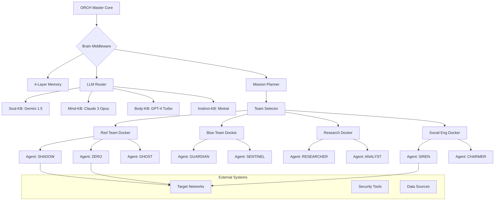

# **MODULAR AGENT TEAM ARCHITECTURE DESIGN**

## **SYSTEM OVERVIEW**

```
┌─────────────────────────────────────────────────────────────────┐
│                    ORCH & MASTER CORE                           │
│  (Compiled Rust Binary - High Security)                        │
│                                                                 │
│  ┌─────────────────┐  ┌─────────────────┐  ┌─────────────────┐ │
│  │   Mission Ctrl  │  │  Agent Registry │  │  Security Layer │ │
│  └─────────────────┘  └─────────────────┘  └─────────────────┘ │
│  ┌─────────────────┐  ┌─────────────────┐  ┌─────────────────┐ │
│  │  Brain Middle-  │  │  Comms Router   │  │  Crypto Engine  │ │
│  │     ware        │  │                 │  │                 │ │
│  └─────────────────┘  └─────────────────┘  └─────────────────┘ │
└───────────────────────────────┬─────────────────────────────────┘
                                │
                                ▼
┌─────────────────────────────────────────────────────────────────┐
│                    AGENT TEAM PLUGINS                           │
│  (Docker Containers / Rust Binaries)                           │
│                                                                 │
│  ┌─────────────┐  ┌─────────────┐  ┌─────────────┐             │
│  │  Red Team   │  │  Blue Team  │  │  Research   │             │
│  │   Docker    │  │   Docker    │  │   Docker    │             │
│  └─────────────┘  └─────────────┘  └─────────────┘             │
│                                                                 │
│  ┌─────────────┐  ┌─────────────┐  ┌─────────────┐             │
│  │  Analytics  │  │  Social Eng │  │  ICS/SCADA  │             │
│  │   Docker    │  │   Docker    │  │   Docker    │             │
│  └─────────────┘  └─────────────┘  └─────────────┘             │
└───────────────────────────────┬─────────────────────────────────┘
                                │
                                ▼
┌─────────────────────────────────────────────────────────────────┐
│                    DEPLOYMENT LAYERS                            │
│                                                                 │
│  ┌─────────────┐  ┌─────────────┐  ┌─────────────┐             │
│  │   Local     │  │   Cloud     │  │   Hybrid    │             │
│  │  Deployment │  │ Deployment  │  │ Deployment  │             │
│  └─────────────┘  └─────────────┘  └─────────────┘             │
└─────────────────────────────────────────────────────────────────┘
```

## **WORKFLOW DIAGRAM**



## **IMPLEMENTATION GUIDE**

### **Step 1: Core ORCH Architecture**

#### **Cargo.toml** (Core ORCH)
```toml
[package]
name = "orch-core"
version = "1.0.0"
edition = "2021"

[dependencies]
tokio = { version = "1.0", features = ["full"] }
serde = { version = "1.0", features = ["derive"] }
serde_json = "1.0"
reqwest = { version = "0.11", features = ["json"] }
async-trait = "0.1"
tracing = "0.1"
tracing-subscriber = "0.3"
uuid = { version = "1.0", features = ["v4"] }
chrono = { version = "0.4", features = ["serde"] }
bincode = "1.3"
config = "0.13"
anyhow = "1.0"
thiserror = "1.0"

# Communication
redis = "0.23"
lapin = { version = "2.0", features = ["tokio"] }
websocket = "0.26"

# Security
ring = "0.17"
aes-gcm = "0.10"
rsa = "0.9"

# Docker API
bollard = "0.15"
```

#### **src/core/orch.rs** - Main ORCH Controller
```rust
use anyhow::Result;
use async_trait::async_trait;
use std::collections::HashMap;
use std::sync::Arc;
use tracing::{info, debug, error, warn};

use crate::brain::BrainMiddleware;
use crate::comms::{CommunicationBus, AgentMessage};
use crate::registry::{AgentRegistry, TeamDescriptor};
use crate::deployment::{DeploymentManager, DeploymentType};

#[derive(Debug, Clone)]
pub struct OrchCore {
    brain: Arc<BrainMiddleware>,
    comms_bus: Arc<CommunicationBus>,
    agent_registry: Arc<AgentRegistry>,
    deployment_manager: Arc<DeploymentManager>,
    active_teams: HashMap<String, ActiveTeam>,
    mission_log: MissionLog,
}

impl OrchCore {
    pub fn new(
        brain: Arc<BrainMiddleware>,
        comms_bus: Arc<CommunicationBus>,
        agent_registry: Arc<AgentRegistry>,
        deployment_manager: Arc<DeploymentManager>,
    ) -> Self {
        Self {
            brain,
            comms_bus,
            agent_registry,
            deployment_manager,
            active_teams: HashMap::new(),
            mission_log: MissionLog::new(),
        }
    }
    
    pub async fn start_mission(&mut self, mission: Mission) -> Result<MissionResult> {
        info!("🚀 Starting mission: {}", mission.name);
        
        // Use Brain for strategic planning
        let strategic_plan = self.brain.plan_mission_strategy(&mission).await?;
        
        // Deploy required teams
        let deployed_teams = self.deploy_mission_teams(&strategic_plan).await?;
        
        // Execute mission phases
        let results = self.execute_mission_phases(&strategic_plan, &deployed_teams).await?;
        
        // Compile mission report
        let mission_result = self.compile_mission_report(&mission, &results).await?;
        
        info!("✅ Mission completed: {}", mission.name);
        Ok(mission_result)
    }
    
    async fn deploy_mission_teams(
        &mut self,
        strategic_plan: &StrategicPlan,
    ) -> Result<HashMap<String, DeployedTeam>> {
        let mut deployed_teams = HashMap::new();
        
        for team_req in &strategic_plan.required_teams {
            info!("🔧 Deploying team: {}", team_req.team_type);
            
            let team_descriptor = self.agent_registry.get_team_descriptor(&team_req.team_type).await?;
            
            // Deploy based on configuration
            let deployed_team = match team_req.deployment_type {
                DeploymentType::Docker => {
                    self.deployment_manager.deploy_docker_team(&team_descriptor).await?
                }
                DeploymentType::Binary => {
                    self.deployment_manager.deploy_binary_team(&team_descriptor).await?
                }
                DeploymentType::Remote => {
                    self.deployment_manager.connect_remote_team(&team_descriptor).await?
                }
            };
            
            // Register team with communication bus
            self.comms_bus.register_team(&deployed_team).await?;
            
            deployed_teams.insert(team_req.team_type.clone(), deployed_team);
            self.active_teams.insert(team_req.team_type.clone(), ActiveTeam {
                descriptor: team_descriptor,
                deployment: deployed_team.clone(),
                status: TeamStatus::Active,
            });
        }
        
        Ok(deployed_teams)
    }
    
    async fn execute_mission_phases(
        &self,
        strategic_plan: &StrategicPlan,
        teams: &HashMap<String, DeployedTeam>,
    ) -> Result<Vec<PhaseResult>> {
        let mut phase_results = Vec::new();
        
        for phase in &strategic_plan.phases {
            info!("🎯 Executing phase: {}", phase.name);
            
            // Assign phase to appropriate team
            if let Some(team) = teams.get(&phase.assigned_team) {
                let phase_task = PhaseTask {
                    phase: phase.clone(),
                    target_team: team.id.clone(),
                    resources: phase.required_resources.clone(),
                };
                
                let result = self.execute_phase_with_team(&phase_task, team).await?;
                phase_results.push(result);
                
                // Check if human intervention needed
                if result.requires_human_attention {
                    warn!("⚠️ Phase requires human attention: {}", phase.name);
                    self.request_human_intervention(&result).await?;
                }
            }
        }
        
        Ok(phase_results)
    }
    
    async fn execute_phase_with_team(
        &self,
        phase_task: &PhaseTask,
        team: &DeployedTeam,
    ) -> Result<PhaseResult> {
        // Send task to team via communication bus
        let task_message = AgentMessage {
            id: uuid::Uuid::new_v4(),
            timestamp: chrono::Utc::now(),
            from: "ORCH_CORE".to_string(),
            to: team.id.clone(),
            message_type: crate::comms::MessageType::TaskAssignment,
            content: serde_json::to_string(&phase_task)?,
            priority: crate::comms::Priority::High,
            requires_ack: true,
            correlation_id: None,
            emotional_context: Default::default(),
            hidden_subtext: None,
        };
        
        self.comms_bus.send_message(task_message).await?;
        
        // Wait for completion with timeout
        let result = tokio::time::timeout(
            phase_task.phase.timeout,
            self.wait_for_phase_completion(phase_task, team)
        ).await??;
        
        Ok(result)
    }
    
    async fn wait_for_phase_completion(
        &self,
        phase_task: &PhaseTask,
        team: &DeployedTeam,
    ) -> Result<PhaseResult> {
        // Implementation would listen for completion messages
        // from the team via the communication bus
        todo!("Implement phase completion monitoring")
    }
}

#[derive(Debug, Clone)]
pub struct Mission {
    pub id: uuid::Uuid,
    pub name: String,
    pub description: String,
    pub objectives: Vec<Objective>,
    pub constraints: Vec<Constraint>,
    pub target_environment: Environment,
    pub required_clearance: ClearanceLevel,
    pub timeline: MissionTimeline,
}

#[derive(Debug, Clone)]
pub struct StrategicPlan {
    pub mission_id: uuid::Uuid,
    pub required_teams: Vec<TeamRequirement>,
    pub phases: Vec<MissionPhase>,
    pub risk_assessment: RiskAssessment,
    pub contingency_plans: Vec<ContingencyPlan>,
}

#[derive(Debug, Clone)]
pub struct TeamRequirement {
    pub team_type: String,
    pub deployment_type: DeploymentType,
    pub capabilities: Vec<String>,
    pub resource_requirements: ResourceRequirements,
}
```

### **Step 2: Team Registry System**

#### **src/registry/mod.rs**
```rust
use anyhow::Result;
use serde::{Deserialize, Serialize};
use std::collections::HashMap;
use std::path::PathBuf;

#[derive(Debug, Clone, Serialize, Deserialize)]
pub struct TeamDescriptor {
    pub team_type: String,
    pub name: String,
    pub description: String,
    pub version: String,
    pub capabilities: Vec<Capability>,
    pub deployment_options: DeploymentOptions,
    pub communication_protocol: CommunicationProtocol,
    pub agents: Vec<AgentDescriptor>,
    pub dependencies: Vec<Dependency>,
}

#[derive(Debug, Clone, Serialize, Deserialize)]
pub struct AgentDescriptor {
    pub name: String,
    pub role: String,
    pub capabilities: Vec<String>,
    pub personality: PersonalityProfile,
    pub communication_channels: Vec<String>,
}

#[derive(Debug, Clone, Serialize, Deserialize)]
pub struct DeploymentOptions {
    pub docker_image: Option<String>,
    pub binary_path: Option<PathBuf>,
    pub remote_endpoint: Option<String>,
    pub resource_requirements: ResourceRequirements,
    pub environment_variables: HashMap<String, String>,
}

pub struct AgentRegistry {
    teams: HashMap<String, TeamDescriptor>,
    remote_registries: Vec<RemoteRegistry>,
}

impl AgentRegistry {
    pub fn new() -> Self {
        Self {
            teams: HashMap::new(),
            remote_registries: Vec::new(),
        }
    }
    
    pub async fn load_team_from_docker(&mut self, image_name: &str) -> Result<()> {
        // Pull Docker image and extract team descriptor
        // This would use Docker API to inspect image labels/metadata
        info!("Loading team from Docker image: {}", image_name);
        
        // Simulated team descriptor for Red Team
        if image_name.contains("red-team") {
            let red_team = TeamDescriptor {
                team_type: "red_team".to_string(),
                name: "Elite Red Team".to_string(),
                description: "Specialized penetration testing team".to_string(),
                version: "1.0.0".to_string(),
                capabilities: vec![
                    Capability::NetworkPenetration,
                    Capability::SocialEngineering,
                    Capability::PrivilegeEscalation,
                ],
                deployment_options: DeploymentOptions {
                    docker_image: Some(image_name.to_string()),
                    binary_path: None,
                    remote_endpoint: None,
                    resource_requirements: ResourceRequirements {
                        cpu: 4,
                        memory_mb: 8192,
                        storage_mb: 1024,
                    },
                    environment_variables: HashMap::new(),
                },
                communication_protocol: CommunicationProtocol::WebSocket,
                agents: vec![
                    AgentDescriptor {
                        name: "SHADOW".to_string(),
                        role: "Reconnaissance Specialist".to_string(),
                        capabilities: vec!["stealth_scanning".to_string(), "osint".to_string()],
                        personality: PersonalityProfile::paranoid_genius(),
                        communication_channels: vec!["recon".to_string(), "emergency".to_string()],
                    },
                    AgentDescriptor {
                        name: "ZERO".to_string(),
                        role: "Exploit Developer".to_string(),
                        capabilities: vec!["exploit_dev".to_string(), "reverse_engineering".to_string()],
                        personality: PersonalityProfile::arrogant_prodigy(),
                        communication_channels: vec!["exploitation".to_string(), "technical".to_string()],
                    },
                    // ... more agents
                ],
                dependencies: vec![],
            };
            
            self.teams.insert("red_team".to_string(), red_team);
        }
        
        Ok(())
    }
    
    pub async fn load_team_from_folder(&mut self, folder_path: &str) -> Result<()> {
        // Load team descriptor from local folder
        let descriptor_path = PathBuf::from(folder_path).join("team_descriptor.json");
        let descriptor_data = tokio::fs::read_to_string(descriptor_path).await?;
        let team_descriptor: TeamDescriptor = serde_json::from_str(&descriptor_data)?;
        
        self.teams.insert(team_descriptor.team_type.clone(), team_descriptor);
        Ok(())
    }
    
    pub async fn get_team_descriptor(&self, team_type: &str) -> Result<TeamDescriptor> {
        self.teams.get(team_type)
            .cloned()
            .ok_or_else(|| anyhow::anyhow!("Team not found: {}", team_type))
    }
    
    pub async fn search_teams_by_capability(&self, capability: &Capability) -> Vec<TeamDescriptor> {
        self.teams.values()
            .filter(|team| team.capabilities.contains(capability))
            .cloned()
            .collect()
    }
}
```

### **Step 3: Deployment Manager**

#### **src/deployment/mod.rs**
```rust
use anyhow::Result;
use bollard::Docker;
use std::collections::HashMap;
use std::path::PathBuf;
use tracing::{info, debug, error};

use crate::registry::TeamDescriptor;

#[derive(Debug, Clone)]
pub enum DeploymentType {
    Docker,
    Binary,
    Remote,
}

pub struct DeploymentManager {
    docker_client: Option<Docker>,
    binary_paths: HashMap<String, PathBuf>,
    remote_endpoints: HashMap<String, String>,
}

impl DeploymentManager {
    pub fn new() -> Self {
        Self {
            docker_client: None,
            binary_paths: HashMap::new(),
            remote_endpoints: HashMap::new(),
        }
    }
    
    pub async fn initialize_docker(&mut self) -> Result<()> {
        self.docker_client = Some(Docker::connect_with_local_defaults()?);
        info!("Docker client initialized");
        Ok(())
    }
    
    pub async fn deploy_docker_team(&self, team: &TeamDescriptor) -> Result<DeployedTeam> {
        let docker = self.docker_client.as_ref()
            .ok_or_else(|| anyhow::anyhow!("Docker client not initialized"))?;
        
        info!("🚀 Deploying Docker team: {}", team.name);
        
        // Pull image if not exists
        self.pull_docker_image(docker, &team.deployment_options.docker_image.as_ref().unwrap()).await?;
        
        // Create container
        let container_config = bollard::container::Config {
            image: team.deployment_options.docker_image.clone(),
            env: Some(
                team.deployment_options.environment_variables
                    .iter()
                    .map(|(k, v)| format!("{}={}", k, v))
                    .collect()
            ),
            ..Default::default()
        };
        
        let container_name = format!("{}-{}", team.team_type, uuid::Uuid::new_v4());
        
        let container = docker.create_container::<&str, &str>(
            Some(bollard::container::CreateContainerOptions {
                name: &container_name,
                platform: None,
            }),
            container_config
        ).await?;
        
        // Start container
        docker.start_container::<&str>(&container.id, None).await?;
        
        info!("✅ Docker team deployed: {}", container_name);
        
        Ok(DeployedTeam {
            id: container_name,
            team_type: team.team_type.clone(),
            deployment_type: DeploymentType::Docker,
            endpoint: format!("http://{}:8080", container_name), // Would be actual endpoint
            status: DeploymentStatus::Running,
        })
    }
    
    pub async fn deploy_binary_team(&self, team: &TeamDescriptor) -> Result<DeployedTeam> {
        let binary_path = team.deployment_options.binary_path
            .as_ref()
            .ok_or_else(|| anyhow::anyhow!("No binary path specified"))?;
        
        info!("🚀 Deploying binary team: {}", team.name);
        
        // Check if binary exists and is executable
        if !binary_path.exists() {
            return Err(anyhow::anyhow!("Binary not found: {:?}", binary_path));
        }
        
        // Start binary process
        let mut command = tokio::process::Command::new(binary_path);
        
        // Set environment variables
        for (key, value) in &team.deployment_options.environment_variables {
            command.env(key, value);
        }
        
        let child = command.spawn()?;
        
        let team_id = format!("binary-{}-{}", team.team_type, uuid::Uuid::new_v4());
        
        info!("✅ Binary team deployed: {}", team_id);
        
        Ok(DeployedTeam {
            id: team_id,
            team_type: team.team_type.clone(),
            deployment_type: DeploymentType::Binary,
            endpoint: "local://binary".to_string(), // Would be actual IPC endpoint
            status: DeploymentStatus::Running,
        })
    }
    
    pub async fn connect_remote_team(&self, team: &TeamDescriptor) -> Result<DeployedTeam> {
        let endpoint = team.deployment_options.remote_endpoint
            .as_ref()
            .ok_or_else(|| anyhow::anyhow!("No remote endpoint specified"))?;
        
        info!("🔗 Connecting to remote team: {} at {}", team.name, endpoint);
        
        // Test connection to remote team
        let client = reqwest::Client::new();
        let response = client.get(endpoint)
            .send()
            .await?;
        
        if !response.status().is_success() {
            return Err(anyhow::anyhow!("Failed to connect to remote team at {}", endpoint));
        }
        
        let team_id = format!("remote-{}-{}", team.team_type, uuid::Uuid::new_v4());
        
        info!("✅ Remote team connected: {}", team_id);
        
        Ok(DeployedTeam {
            id: team_id,
            team_type: team.team_type.clone(),
            deployment_type: DeploymentType::Remote,
            endpoint: endpoint.clone(),
            status: DeploymentStatus::Connected,
        })
    }
    
    async fn pull_docker_image(&self, docker: &Docker, image: &str) -> Result<()> {
        // Check if image exists locally
        // If not, pull it
        // This is simplified - actual implementation would handle errors and progress
        info!("📥 Pulling Docker image: {}", image);
        // docker.pull_image(...).await?;
        Ok(())
    }
}

#[derive(Debug, Clone)]
pub struct DeployedTeam {
    pub id: String,
    pub team_type: String,
    pub deployment_type: DeploymentType,
    pub endpoint: String,
    pub status: DeploymentStatus,
}

#[derive(Debug, Clone)]
pub enum DeploymentStatus {
    Starting,
    Running,
    Connected,
    Error(String),
    Stopped,
}
```

### **Step 4: Docker Team Example**

#### **red-team/Dockerfile**
```dockerfile
FROM rust:1.70 as builder

WORKDIR /app
COPY . .
RUN cargo build --release

FROM debian:bookworm-slim
RUN apt-get update && apt-get install -y \
    ca-certificates \
    && rm -rf /var/lib/apt/lists/*

WORKDIR /app
COPY --from=builder /app/target/release/red-team-agent .
COPY team_descriptor.json .

# Expose communication port
EXPOSE 8080

# Health check
HEALTHCHECK --interval=30s --timeout=10s --start-period=5s --retries=3 \
    CMD curl -f http://localhost:8080/health || exit 1

CMD ["./red-team-agent"]
```

#### **red-team/team_descriptor.json**
```json
{
  "team_type": "red_team",
  "name": "Elite Red Team",
  "description": "Specialized penetration testing team with advanced capabilities",
  "version": "1.0.0",
  "capabilities": [
    "network_penetration",
    "social_engineering", 
    "privilege_escalation",
    "persistence",
    "lateral_movement"
  ],
  "deployment_options": {
    "docker_image": "registry.example.com/red-team:latest",
    "binary_path": null,
    "remote_endpoint": null,
    "resource_requirements": {
      "cpu": 4,
      "memory_mb": 8192,
      "storage_mb": 1024
    },
    "environment_variables": {
      "LOG_LEVEL": "info",
      "ORCH_ENDPOINT": "ws://orch-core:8080"
    }
  },
  "communication_protocol": "websocket",
  "agents": [
    {
      "name": "SHADOW",
      "role": "Reconnaissance Specialist",
      "capabilities": ["stealth_scanning", "osint", "network_mapping"],
      "personality": {
        "type": "paranoid_genius",
        "confidence": 0.9,
        "paranoia": 0.95
      },
      "communication_channels": ["recon", "emergency"]
    },
    {
      "name": "ZERO", 
      "role": "Exploit Developer",
      "capabilities": ["exploit_dev", "reverse_engineering", "weaponization"],
      "personality": {
        "type": "arrogant_prodigy", 
        "confidence": 1.0,
        "sarcasm_level": 0.9
      },
      "communication_channels": ["exploitation", "technical"]
    }
  ],
  "dependencies": []
}
```

### **Step 5: Main Application Entry**

#### **src/main.rs**
```rust
use anyhow::Result;
use std::sync::Arc;
use tracing_subscriber;

mod core;
mod brain;
mod comms;
mod registry;
mod deployment;

use core::orch::OrchCore;
use brain::middleware::BrainMiddleware;
use comms::CommunicationBus;
use registry::AgentRegistry;
use deployment::DeploymentManager;

#[tokio::main]
async fn main() -> Result<()> {
    // Initialize logging
    tracing_subscriber::init();
    
    info!("🚀 Starting ORCH Core System...");
    
    // Initialize components
    let brain = Arc::new(BrainMiddleware::new()?);
    let comms_bus = Arc::new(CommunicationBus::new().await?);
    let mut agent_registry = Arc::new(AgentRegistry::new());
    let mut deployment_manager = Arc::new(DeploymentManager::new());
    
    // Initialize deployment manager
    deployment_manager.initialize_docker().await?;
    
    // Load available teams
    info!("📥 Loading available agent teams...");
    
    // Load from Docker Hub or local registry
    agent_registry.load_team_from_docker("registry.example.com/red-team:latest").await?;
    agent_registry.load_team_from_docker("registry.example.com/blue-team:latest").await?;
    agent_registry.load_team_from_docker("registry.example.com/research-team:latest").await?;
    
    // Load from local folders
    agent_registry.load_team_from_folder("./teams/social-engineering").await?;
    agent_registry.load_team_from_folder("./teams/ics-scada").await?;
    
    // Create ORCH core
    let mut orch_core = OrchCore::new(
        brain,
        comms_bus,
        agent_registry,
        deployment_manager,
    );
    
    info!("✅ ORCH Core initialized with {} teams", 
          orch_core.agent_registry.team_count().await);
    
    // Start mission loop
    orch_core.start_mission_loop().await?;
    
    Ok(())
}
```

### **Step 6: Usage Examples**

#### **Example 1: Deploy Red Team via Docker**
```rust
// Deploy and run a red team mission
let mission = Mission {
    name: "Network Penetration Test".to_string(),
    description: "Comprehensive security assessment of target network".to_string(),
    objectives: vec![
        "Gain initial access".to_string(),
        "Establish persistence".to_string(), 
        "Exfiltrate sensitive data".to_string(),
    ],
    target_environment: Environment::CorporateNetwork,
    required_clearance: ClearanceLevel::High,
    timeline: MissionTimeline::default(),
};

let result = orch_core.start_mission(mission).await?;
println!("Mission completed: {:?}", result);
```

#### **Example 2: Deploy Binary Team**
```rust
// Use locally compiled team binary
agent_registry.load_team_from_folder("./teams/custom-red-team").await?;

let mission = Mission {
    name: "Custom Assessment".to_string(),
    // ... mission details
};

let result = orch_core.start_mission(mission).await?;
```

#### **Example 3: Multi-Team Operation**
```rust
// Combine multiple teams for complex mission
let mission = Mission {
    name: "Advanced Persistent Threat Simulation".to_string(),
    description: "Simulate sophisticated APT attack".to_string(),
    objectives: vec![
        "Initial compromise via social engineering".to_string(),
        "Internal network reconnaissance".to_string(),
        "Lateral movement and privilege escalation".to_string(),
        "Data exfiltration and persistence".to_string(),
    ],
    // This would automatically deploy red team + social engineering team
    // ... other mission details
};
```

## **DEPLOYMENT STRATEGIES**

### **Option 1: Docker Compose (Recommended)**
```yaml
# docker-compose.yml
version: '3.8'

services:
  orch-core:
    build: .
    ports:
      - "8080:8080"
    environment:
      - RUST_LOG=info
      - OPENROUTER_API_KEY=${OPENROUTER_API_KEY}
    volumes:
      - ./config:/app/config
      - ./teams:/app/teams

  red-team:
    image: registry.example.com/red-team:latest
    environment:
      - ORCH_ENDPOINT=ws://orch-core:8080
    depends_on:
      - orch-core

  blue-team:
    image: registry.example.com/blue-team:latest  
    environment:
      - ORCH_ENDPOINT=ws://orch-core:8080
    depends_on:
      - orch-core

  # Additional teams...
```

### **Option 2: Kubernetes**
```yaml
# k8s/orch-deployment.yaml
apiVersion: apps/v1
kind: Deployment
metadata:
  name: orch-core
spec:
  replicas: 1
  selector:
    matchLabels:
      app: orch-core
  template:
    metadata:
      labels:
        app: orch-core
    spec:
      containers:
      - name: orch-core
        image: registry.example.com/orch-core:latest
        ports:
        - containerPort: 8080
        env:
        - name: OPENROUTER_API_KEY
          valueFrom:
            secretKeyRef:
              name: api-keys
              key: openrouter
---
apiVersion: v1
kind: Service
metadata:
  name: orch-core
spec:
  selector:
    app: orch-core
  ports:
  - port: 8080
    targetPort: 8080
```

### **Option 3: Bare Metal**
```bash
# Compile and run directly
cargo build --release
./target/release/orch-core

# Run individual teams
./teams/red-team/target/release/red-team-agent
./teams/blue-team/target/release/blue-team-agent
```

## **SECURITY CONSIDERATIONS**

1. **Compiled Core**: ORCH core is compiled Rust for maximum security
2. **Team Isolation**: Each team runs in separate container/process
3. **Communication Encryption**: All inter-team communication encrypted
4. **Access Control**: Role-based access to different team capabilities
5. **Audit Logging**: Complete audit trail of all operations

This architecture gives you:
- **Modularity**: Teams can be developed independently
- **Scalability**: Deploy on single machine or across cloud
- **Flexibility**: Mix Docker, binaries, and remote teams
- **Security**: Compile core for maximum protection
- **Control**: ORCH maintains complete oversight

The system is designed so you can easily add new teams by simply creating new Docker images or binary packages that follow the team descriptor specification.
